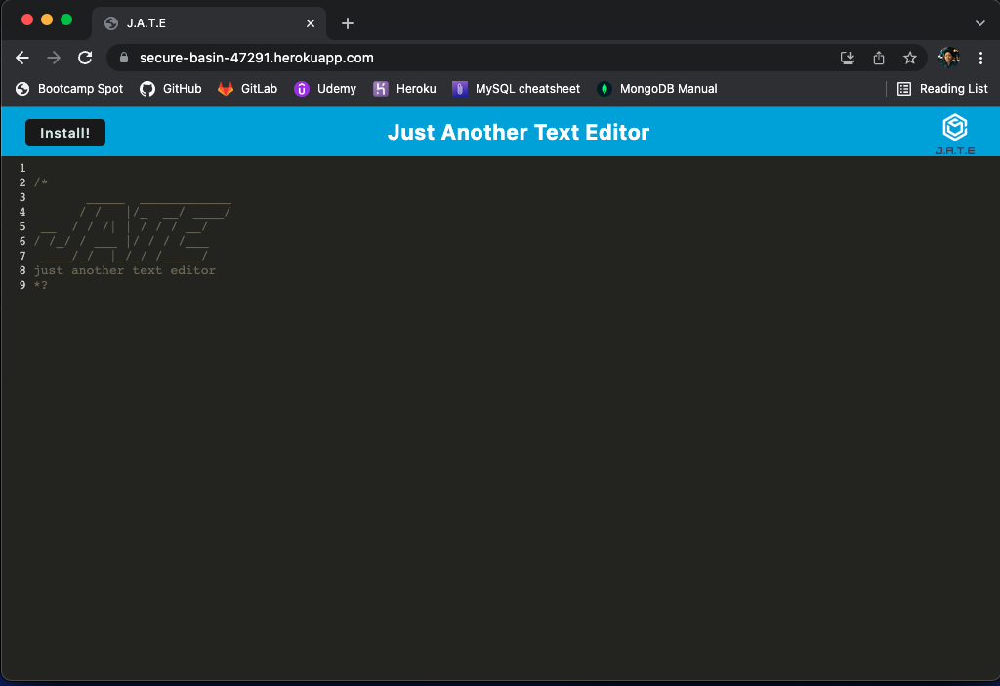
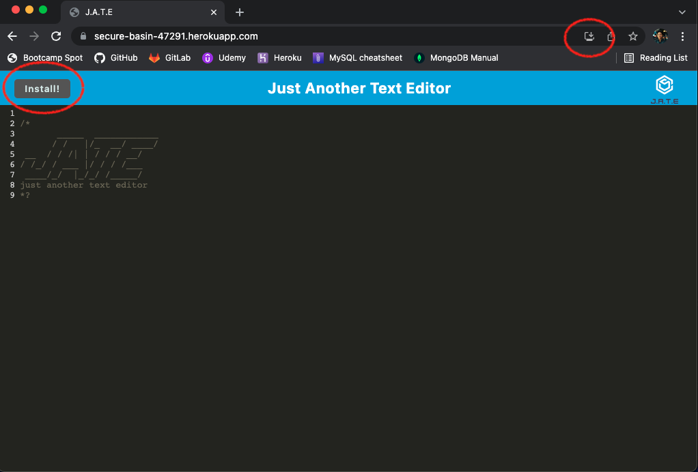
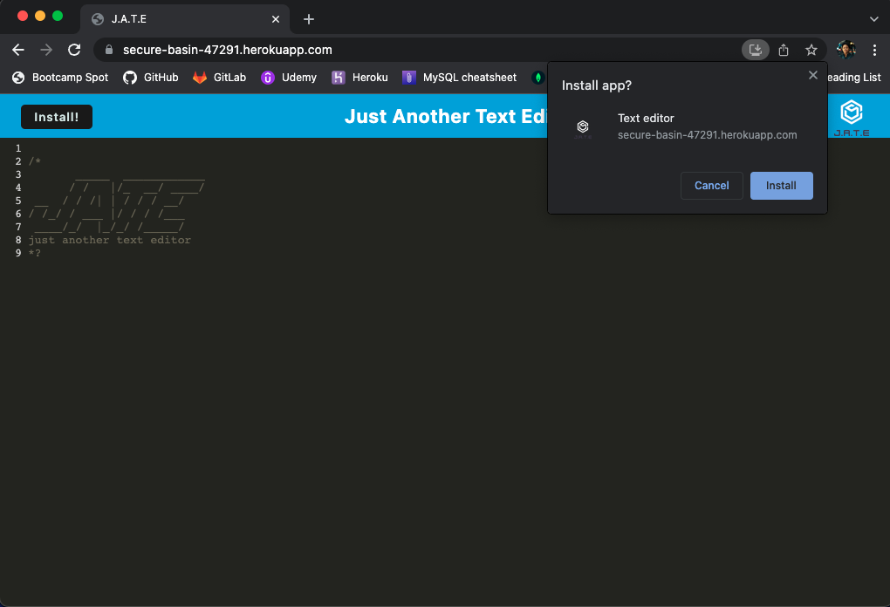
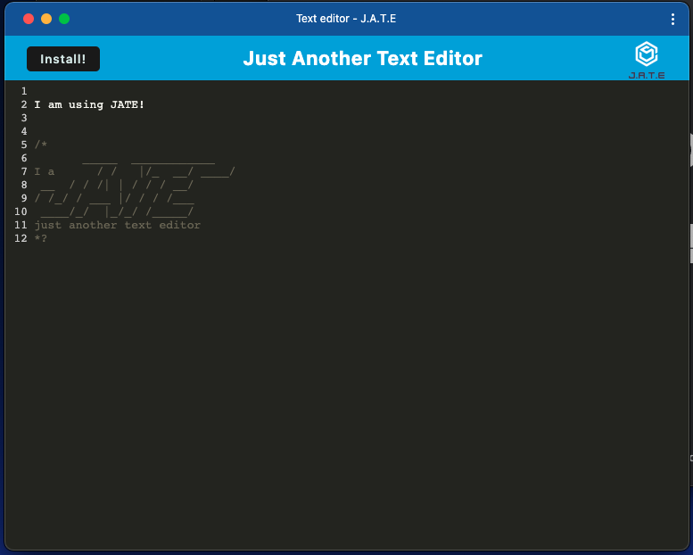

# Text Editor PWA

Table of Contents

  <ol>
    <li><a href="#description">Description</a></li>
    <li><a href="#built-with">Built With</a></li>
    <li><a href="#installation">Installation</a></li>
    <li><a href="#usage">Usage</a></li>
    <li><a href="#future-updates">Future Updates</a></li>
  </ol>

## Description

This is a Text Editor app that you can use online and offline (after you've loaded this page). You can also install this onto your own local machine through Google Chrome (ses Installation section).

## Built With

Some of the technologies used to make this app: IndexDB, Manifest, Webpack, Babel, Workbox., CSS loader, and NodeJS. Deployed via Heroku.

## Installation

Git clone onto your local machine. Open up the root folder in your command line interface and run `npm i`. From there run `npm start:dev`.

Open up the localhost url in your browser (for example: http://localhost:3000) to see the working app.

Or visit https://secure-basin-47291.herokuapp.com/ and click on the install button on the left or in the top right, as marked by the red circles below.

Clicking on either button will show:

This how the installed application should look: 

## Usage

In this app, you can type content into it and it will remain there even after refreshing and/or closing the browser. Similar to the Windows Notepad but no saving needed!

## Future Updates

This was a class homework assignment with starter code in it. There were certain components included that I did not use. Would love to explore that one day.
